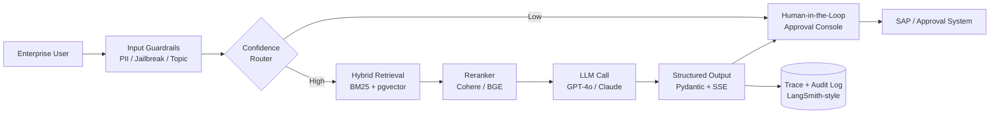

<!-- HERO BANNER -->

<!-- ANIMATED ROLE TAGLINE -->

<!-- LIVE PORTFOLIO CTA -->

  
   
  <i>Interactive site &middot; Next.js &middot; GSAP &middot; Three.js &middot; Framer Motion</i>

<!-- IDENTITY STRIP -->

  
  
  
  

---

## About

Enterprise GenAI Engineer with **4+ years** designing and shipping production-grade LLM systems for regulated enterprise workflows. I work where retrieval quality, structured outputs, governance, and cost control matter — building systems that pass finance, procurement, and compliance review without losing engineering rigor.

> **Currently** building production GenAI at **Jio Platforms (Reliance)** — LLM-assisted financial decision workflows with deterministic fallbacks, RAG over policy documents with role-based access controls, and a centralized LLM evaluation/governance framework with prompt versioning, drift detection, hallucination guards, and rollback. Pursuing **M.Tech, Software Systems at BITS Pilani (WILP)**.

---

## Impact in Numbers

<table>
  <tr>
    <td align="center" width="33%">
      <h2>10,000+</h2>
      <b>Employees Served</b> across enterprise platforms
    </td>
    <td align="center" width="33%">
      <h2>4+ yrs</h2>
      <b>Production Experience</b> backend &amp; GenAI systems
    </td>
    <td align="center" width="33%">
      <h2>30%</h2>
      <b>Faster Response Times</b> via architectural &amp; perf wins
    </td>
  </tr>
  <tr>
    <td align="center">
      <h2>25%</h2>
      <b>Workflow Efficiency Gain</b> LLM-assisted decision flows
    </td>
    <td align="center">
      <h2>20%</h2>
      <b>Procurement Cycle Cut</b> scalable financial platform
    </td>
    <td align="center">
      <h2>35%</h2>
      <b>Lower Latency</b> event-driven services &amp; dashboards
    </td>
  </tr>
</table>

---

## Enterprise GenAI Capabilities

- **Decision Support** — LLM-powered systems with deterministic fallbacks, confidence-based routing, and human approval workflows for compliance-sensitive use cases.
- **RAG & Retrieval** — Retrieval-Augmented Generation pipelines over enterprise data with hybrid retrieval (BM25 + dense vectors), reranking, and strict role-based access controls.
- **Structured I/O & Streaming** — JSON-mode and Pydantic schemas plus SSE token streaming, so model output can flow safely into downstream backend systems and real-time approval consoles.
- **Evaluation & Governance** — Offline regression suites, LLM-as-a-Judge scoring, drift and hallucination detection, prompt and configuration versioning, and rollback strategies.
- **Event-Driven Integration** — GenAI services wired into event-driven backends with retries, circuit isolation, semantic caching, rate limiting, and trace-level observability.
- **Cloud-Native Guardrails** — Audit logging, PII redaction, jailbreak and topic-boundary defense, and granular cost and token-budget enforcement.

---

## Architecture Snapshot

---

  

## Tech Matrix

**GenAI &amp; LLM Engineering**

**RAG &amp; Retrieval**

**LLM Ops &amp; Governance**

**AI Frameworks &amp; Agents**

**Backend &amp; Systems**

**Data &amp; Storage**

**Frontend**

**Infra &amp; Engineering Practices**

---

## Featured Projects

<table>
<tr>
<td width="50%" valign="top">

### Enterprise Financial Policy Assistant
**RAG · Hybrid Search · Human-in-the-Loop**

LLM-assisted financial analysis grounded in internal policy documents, with role-based document retrieval and structured prompt templates that constrain responses to approved enterprise sources.

- Hybrid search (**BM25 + dense vectors over pgvector**) with a reranking stage
- Recursive + semantic chunking tuned for adversarial finance queries
- Pydantic-validated JSON streamed to the approval console via **SSE**
- Confidence-based routing with full audit trails of prompts, context, outputs, and decisions

`FastAPI` `Python` `pgvector` `Redis` `LangChain` `OpenAI`

> **Impact** — sub-second perceived latency on long answers, full auditability for compliance-critical decisions.

</td>
<td width="50%" valign="top">

### LLM Evaluation, Monitoring &amp; Governance Framework
**Prompt Versioning · LLM-as-a-Judge · Trace Observability**

Centralized framework for testing, monitoring, and governing LLM behavior across enterprise applications — treating GenAI behavior as code with traceable changes and rollback capability.

- Automated quality scoring via **LLM-as-a-Judge** rubrics + heuristic checks
- Detection for hallucinations, retrieval failures, and behavioral drift
- End-to-end spans across **prompt → retrieval → generation → output**
- Semantic caching and per-tenant token budgets for cost control

`Python` `FastAPI` `LangSmith / Langfuse-style` `Redis` `PostgreSQL`

> **Impact** — post-hoc replay and root-cause analysis on failed runs, enforced cost and reliability constraints.

</td>
</tr>
</table>

---

  

## GitHub Analytics

  

  

  

  

<picture>
  <source media="(prefers-color-scheme: dark)" srcset="https://raw.githubusercontent.com/Jayesh12356/Jayesh12356/output/github-contribution-grid-snake-dark.svg" />
  <source media="(prefers-color-scheme: light)" srcset="https://raw.githubusercontent.com/Jayesh12356/Jayesh12356/output/github-contribution-grid-snake.svg" />
  
</picture>

  

---

## Education

Top-percentile academic record across postgraduate, undergraduate, and school. Currently pursuing <b>M.Tech in Software Systems</b> at <b>BITS Pilani (WILP)</b>.

<table>
  <tr>
    <td align="center" width="25%">
      
      <h2>8.1&nbsp;/ 10</h2>
      <b>M.Tech &middot; Software Systems</b> 
      BITS Pilani &mdash; WILP 
      <i>2022 &mdash; 2026</i>
    </td>
    <td align="center" width="25%">
      
      <h2>9.0&nbsp;/ 10</h2>
      <b>B.Sc. &middot; Computer Science</b> 
      Pillai College (Autonomous) 
      <i>2019 &mdash; 2022</i>
    </td>
    <td align="center" width="25%">
      
      <h2>90%</h2>
      <b>CBSE &middot; Higher Secondary</b> 
      Kendriya Vidyalaya Jr. College 
      <i>2017 &mdash; 2019</i>
    </td>
    <td align="center" width="25%">
      
      <h2>92.8%</h2>
      <b>CBSE &middot; Class 10</b> 
      Datta Meghe World Academy 
      <i>2016 &mdash; 2017</i>
    </td>
  </tr>
</table>

---

## Connect

  

<b>Reliability-first · Audit-first · Production-first.</b>

 

